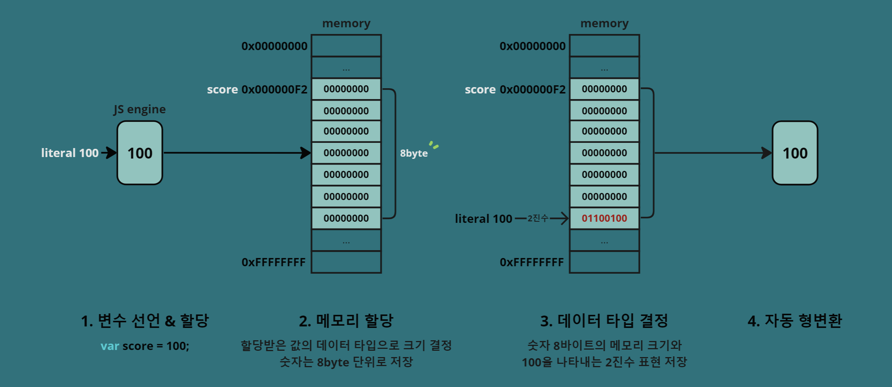

> #### 참고한 교재
>
> [모던 자바스크립트 Deep Dive](https://product.kyobobook.co.kr/detail/S000001766445)

# 06장 데이터 타입

  <br>
  
## 1. 자바스크립트 타입 분류

- 6가지(ES5) + symbol(ES6)

### 원시 타입

| 종류        | 설명                       | 예시                  |
| ----------- | -------------------------- | --------------------- |
| `undefined` | 값이 할당되지 않은 상태    | `let x;`              |
| `null`      | 값이 없음                  | `let y = null;`       |
| `boolean`   | 논리값                     | `let isTrue = true;`  |
| `number`    | 숫자                       | `let num = 42;`       |
| `string`    | 문자열                     | `let str = 'Hello';`  |
| `symbol`    | 고유하고 변경할 수 없는 값 | `let sym = Symbol();` |

### 객체 타입

| 종류       | 설명                                     | 예시                     |
| ---------- | ---------------------------------------- | ------------------------ |
| `object`   | 복잡한 데이터 및 기능을 표현하는 데 사용 | `let obj = {};`          |
| `function` | 함수                                     | `function foo() {}`      |
| `array`    | 배열                                     | `let arr = [1, 2, 3];`   |
| `Date`     | 날짜와 시간 정보                         | `let date = new Date();` |
| `RegExp`   | 정규 표현식                              | `let regex = /pattern/;` |

> 📌 **헷갈렸던 개념**
>
> - 7개의 데이터 타입은 **원시 타입**과 **객체 타입**으로 분류된다.
> - `typeof`로 데이터 타입을 출력했을 때 **7개의 타입**으로 출력된다.
>   (ES5에서는 `symbol` 타입이 없었지만 ES6에서 `symbol` 타입이 추가되어 7개가 되었다.)
>
> - 예를 들어 `null` 타입은 `typeof`로 데이터 타입을 확인하면 null이 아닌 `object`로 출력이 된다.
> - 밑에서 7개의 데이터 타입에 대해 작성해 보려 한다.

<br>

## 2. typeof로 타입 확인하기

- symbol 이외의 원시 값은 리터럴을 통해 생성
- symbol은 `Symbol` 함수를 호출하여 생성
- `object`는 여러 데이터 타입을 포함하는 복합 데이터 타입으로,
  함수, 배열 등이 속함

| 데이터 타입 | 설명                                       |
| ----------- | ------------------------------------------ |
| number      | 정수, 실수 구분 없이 오직 하나의 숫자 타입 |
| string      | 문자열                                     |
| boolean     | 논리적 참(true)과 거짓(false)              |
| undefined   | var 키워드로 선언된 변수에 암묵적 할당 값  |
| null        | 값이 없음을 명시                           |
| symbol      | 변경 불가능한(중복되지 않는) 값            |
| object      | 객체, 함수, 배열 등                        |

```javascript
// 1. number type
let num = 42;
console.log(typeof num); // "number"

// 2. string type
let str = 'Hello, World!';
console.log(typeof str); // "string"

// 3. boolean type
let isTrue = true;
console.log(typeof isTrue); // "boolean"

// 4. undefined type
let undefinedVar;
console.log(typeof undefinedVar); // "undefined"

// 5. object type
let person = { name: 'John', age: 30 };
console.log(typeof person); // "object"

// 6. symbol type
let uniqueSymbol = Symbol('unique');
console.log(typeof uniqueSymbol); // "symbol"

// 7. function type
function add(a, b) {
  return a + b;
}
console.log(typeof add); // "function"

// 8. null type
let nullVar = null;
console.log(typeof nullVar); // "object" (주의: typeof null은 "object"를 반환)
```

  <br>

#### ✅ 타입별 특징

- **number**  
  배정밀도 64비트 부동소수점 형식(모든 수를 실수로 처리)
  `Infinity`, `-Infinity`, `NaN` 표현 가능
  >
- **string**  
  '작은 따옴표', "큰 따옴표", \`백틱\` 으로 표현 가능
  백틱(\` \`)은 **템플릿 리터럴** 표기법을 사용 가능하고 ES6부터 도입됨
  >
- **undefined**  
  var로 선언한 변수의 값이 암묵적으로 undefined로 초기화 됨
  var로 선언한 변수에 값을 할당하지 않으면 반환되는 타입
  >
- **null**  
  대소문자 구별로 인해 Null, NULL은 null(값이 없음)을 뜻하지 않음
  함수가 유효한 값을 반환할 수 없는 경우 null 반환

```javascript
// HTML 요소를 검색해 반환하는 document.querySelector 메서드
// .myClass를 가지고 있지 않으면 null을 반환
var element = document.querySelector('.myClass');
console.log(element); // null
```

- **symbol**
  심벌 이외의 원시 값은 리터럴을 통해 생성
  심벌은 `Symbol` 함수를 호출해 생성
  ES6에서 추가된 타입이며 변경이 불가능한 원시 타입의 값
  >
- **object**
  자바스크립트는 객체 기반의 언어. 6가지 타입(숫자, 문자열, 불리언, 심볼, 널, 언디파인) 제외하고는 모두 객체 타입

  <br>

### 🧐 템플릿 리터럴

- 백틱( `` )을 사용해 템플릿 리터럴로 변수나 표현식을 문자열에 쉽게 삽입 가능
- python의 f-string과 유사한 기능

```javascript
// ES5
var name = "World";
console.log("Hello, " + name + "!");

// ES6
let name = "World";
console.log(`Hello, ${name}!`);

// python의 f-string
name = "World"
print(f"Hello, {name}!")
```

<br>

## 3. 데이터 타입의 필요성

요약해서 살펴보면 데이터 타입이 필요한 이유는 다음과 같다.

- 변수에 값을 할당할 때의 메모리 크기 결정
- 값을 참조할 때 읽어들여야 할 메모리 공간 크기 결정
- 2진수로 저장된 메모리를 불러올 때 해석을 어떻게 할지 결정

이렇게만 보면 잘 이해가 가지 않으니 예시와 함께 살펴보자.
아래는 score의 데이터 타입이 number로 결정되기까지의 과정이다.

```javascript
var score = 100;
console.log(typeof score); // number
```



#### 값의 할당

- `var score = 100;`에서 `100`은 숫자 리터럴로 인식되어 변수 `score`에 할당
  할당된 값에 따라 자바스크립트는 변수의 데이터 타입을 동적으로 결정

#### 메모리 할당

- 변수 `score`에 할당된 메모리 공간은 해당 값의 데이터 타입에 따라 결정

#### 데이터 타입 결정

- 변수 score에 할당된 값이 100이므로, 자바스크립트는 이 값을 숫자로 해석하고 변수의 데이터 타입을 숫자(Number)로 결정
- 숫자의 경우 8바이트의 메모리 크기를 가지고, 해당 메모리에는 100을 나타내는 2진수 표현이 저장됨

#### 자동 형변환

- 변수 score를 사용할 때 다른 연산이나 필요에 따라 자동 형변환이 발생할 수도 있음
- 자바스크립트는 동적 타입 언어이므로 변수의 데이터 타입은 실행 중에 동적으로 결정되며, 할당된 값에 따라 자동으로 형변환이 이루어진다..

> #### 내가 이해한 내용
>
> 자바스크립트가 어떻게 변수의 데이터 타입을 정의하게 되는지 살펴보자
> 우선 변수를 선언하고 값을 할당하면 메모리에는 2진수로 저장이 된다.
> 만약 `score`에 `100`을 할당하면 메모리에는 `8byte`의 공간이 만들어지고 `100`의 2진수인 `0110 0100`가 메모리에 저장이 된다. 그리고 `score`는 `0110 0100`을 `number` 타입으로 불러오고 `100`이라는 숫자를 출력하게 된다.
>
> `score`에 할당하는 값의 데이터 타입을 따르는 것임
> 그니까 `score`에 `100`이 들어갔으니까 `score`의 데이터 타입은 `number`라고 결정이 되고 `number` 데이터 타입의 메모리 크기 만큼 메모리 공간을 확보한다. 그게 `8byte`라서 메모리에 그 크기에 맞게 `0110 0100`로 저장됨.
> `score`를 참조할 때 `0110 0100`의 메모리 크기가 `8byte`임을 확인하고 `score`의 값을 참조할 때는 메모리의 크기가 `8byte`라고 알아둠
> 이제 그 메모리에 들어있는 2진수 `0110 0100`을 어떤 타입으로 해석할지 결정 (숫자로 해석하면 `100`이고 문자(아스키코드)로 해석하면 `d`임)

<br>

## 4. 동적 타이핑

### 정적 타입 언어

- 명시적 타입 선언(변수에 할당할 값의 데이터 타입 사전에 선언)
- 변수에 선언한 타입에 맞는 값만 할당 가능
- 예) C, C++, Java, Kotlin, Go, Haskell, Rust, Scala ..

### 동적 타입 언어

- 타입 추론(변수에 할당한 값에 의해 타입이 동적으로 결정)
- 재할당에 의해 언제든지 타입이 변할 수 있음 ➡️ **동적 타이핑**
- 예) JavaScript, Python, PHP, Ruby, Lisp, Perl ..

<br>

#### ⭐ 동적 타입의 단점 ⭐

1. 변화하는 변수 값을 추적하기 어려울 수 있음
2. 값을 확인하기 전에는 타입을 확신할 수 없음
3. 개발자의 의도와 상관없이 암묵적으로 타입이 자동 변환 되기도 함
4. 유연성은 높지만 신뢰성은 떨어짐
5. 데이터 타입을 체크해야 하는 경우 번거롭고 코드 양이 증가함

#### ⭐ 동적 타입 주의 사항 ⭐

6. 변수는 꼭 필요할 때만 사용
7. 변수의 스코프를 좁게 만들기
8. 전역 변수는 최대한 사용하지 않기
9. 변수보다 상수를 사용해 값의 변경을 억제하기
10. 의미 파악이 가능하도록 변수 이름 짓기
